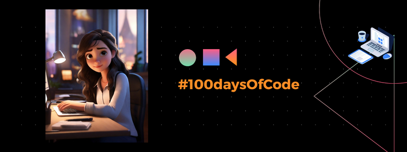

<h1 align="center">
	
 </h1>

 

 

### 🗣️ About

> _O #100daysOfCode é um desafio pessoal popular entre desenvolvedores de software e entusiastas da programação. A ideia é simples: dedicar-se a codificar todos os dias durante 100 dias consecutivos. O objetivo principal é desenvolver consistência na prática da programação, construir hábitos saudáveis de aprendizado e aprimorar as habilidades técnicas ao longo do tempo. O desafio não exige um tempo mínimo de codificação por dia, embora muitos participantes optem por reservar pelo menos 30 minutos ou mais para se concentrar em projetos, estudos ou práticas de codificação. É uma maneira eficaz de progredir gradualmente, seja aprendendo uma nova linguagem de programação, aprofundando-se em um framework específico ou trabalhando em projetos pessoais._

---

🖖 Regras do Desafio #100DaysCode
---

1. Comprometa-se Publicamente

* Declare seu desafio: Anuncie no Twitter, Instagram, LinkedIn, ou qualquer outra rede social usando a hashtag #100DiasDeCodigo. Isso aumenta sua responsabilidade e motivação.
 

2. Dedique Tempo Diariamente
* Tempo mínimo diário: Dedique no mínimo 30 minutos todos os dias ao aprendizado ou à prática na sua área escolhida durante os próximos 100 dias.
 

3. Compartilhe seu Progresso
* Atualizações diárias: Compartilhe seu progresso diariamente nas redes sociais com a hashtag #100DaysOfCode. Isso não apenas documenta sua jornada, mas também inspira e motiva outros.
* Documentação: Mantenha um log diário do seu progresso. Pode ser um diário físico, um blog, um repositório no GitHub ou qualquer plataforma de sua preferência. Isso ajuda a refletir sobre o aprendizado e a manter o foco.
 

4. Encoraje a Participação Comunitária
* Suporte mútuo: Interaja com outros participantes do desafio. Ofereça encorajamento, compartilhe recursos úteis e celebre os sucessos juntos.
 

5. Planeje Seus Objetivos
* Definição de metas: Antes de começar, defina claramente o que você deseja alcançar com esse desafio. Estabeleça metas específicas, mensuráveis, alcançáveis, relevantes e temporais (SMART). Esse conteúdo pode te ajudar: https://www.instagram.com/reel/CzBOpJ1gWid/
 

6. Adapte o Desafio às Suas Necessidades
* Flexibilidade: Embora a consistência diária seja crucial, adapte a intensidade e o foco do desafio conforme necessário para atender às suas circunstâncias pessoais e profissionais.
 

7. Explore e Expanda
* Aprendizado contínuo: Esteja aberto para explorar novos recursos, ferramentas e metodologias ao longo do desafio. O aprendizado é um processo contínuo e dinâmico.
 

8. Celebre Cada Marco
* Reconhecimento: Celebre seus sucessos e marcos alcançados durante o desafio. Isso serve como motivação para continuar e reconhece o esforço investido.
 

9. Reflita e Ajuste
* Reflexão: Regularmente, reserve um tempo para refletir sobre o que está funcionando e o que não está. Ajuste sua abordagem conforme necessário para maximizar o aprendizado e o crescimento.

## 🎯  Objetivos

* Curso Full stack javascript do One bit code. Assistir pelo menos 2 aulas por dia.
* Exercícios de javascript, pelo menos 30min por dia.
* Aprofundar conhecimento necessário para projetos da 42sp.

## 👇 Author

 | [ Jessica Fernanda](https://github.com/nandajfa) |
 | :---: |
 
 [)](https://www.linkedin.com/in/jessica-fernanda-programadora/)

